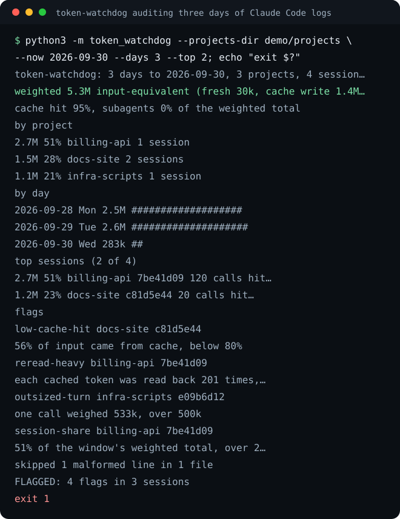

# token-watchdog

Reads the session logs Claude Code keeps on your machine and tells you which sessions and projects burned tokens wastefully, and why: a cache that kept missing, or a context read back hundreds of times after it stopped being useful. It never calls a model, so the audit itself costs nothing, and it exits 1 when something needs a look, so it can run from cron or CI.




## Ten seconds

```bash
pipx install git+https://github.com/eliferres/token-watchdog
token-watchdog
```

With no arguments it reads `~/.claude/projects` (or `$CLAUDE_CONFIG_DIR/projects`) for the last seven days. It is not on PyPI; the install reads the repository directly. Python 3.9 or newer, standard library only.

To run the demo shown above from a clone:

```bash
git clone https://github.com/eliferres/token-watchdog.git
cd token-watchdog
python3 -m token_watchdog --projects-dir demo/projects --now 2026-09-30 --days 3 --top 2
```

`demo/projects` holds invented transcripts with one problem of each kind planted in it; `demo/healthy` holds a clean pair of sessions:

```console
$ python3 -m token_watchdog --projects-dir demo/healthy --now 2026-09-30 --days 3; echo "exit $?"
token-watchdog: 3 days to 2026-09-30, 2 projects, 2 sessions, 130 calls
weighted 1.7M input-equivalent (fresh 390, cache write 205k, cache read 8.4M, output 117k)
cache hit 97%, subagents 0% of the weighted total

by project
     1.3M   77%  billing-api  1 session
     372k   22%  docs-site    1 session

by day
  2026-09-28 Mon     653k  ####################
  2026-09-29 Tue     659k  ####################
  2026-09-30 Wed     372k  ###########

top sessions (2 of 2)
     1.3M   77%  billing-api  4d2e8f61   100 calls  hit  97%  reread  47x  subagents 0%
     372k   22%  docs-site    9f13ab5c    30 calls  hit  96%  reread  27x  subagents 0%

CLEAN: no flags
exit 0
```

Every output in this README and in the picture comes from `demo/transcript.json`, which the test suite replays against the tool and checks the README against, so neither can drift from what the tool prints.

## Flags

| Rule | What it catches | Default | Why it is worth a look |
| --- | --- | --- | --- |
| `low-cache-hit` | A session where a small share of input came from the prompt cache | under 80% | Claude Code re-sends the whole conversation on every call, so a healthy long session reads most of it from cache. A low share means the prefix kept changing (instructions or tools edited mid-session, a model switch, a resume after the cache expired) and the same context was paid at write price again. |
| `reread-heavy` | A session that read each cached token back far more often than it wrote one | over 100 reads per written token | Each call re-reads the full context. A ratio this high means a large context was carried through many turns after it stopped being useful; compacting or starting fresh would have cost less. |
| `outsized-turn` | One API call that is both large and a large part of its own session | over 500k input-equivalent and at least 10% of its session | A call that size which dominates its session is usually a full cache rewrite after an idle gap, or a very large file or tool result pulled into context. The size alone is not enough: on a model with a 1M-token context, a routine full-context cache write passes 500k, and in one measured week of real logs 114 calls passed 500k, half of them under 2% of their session's weight. |
| `session-share` | One session holding an outsized share of the window | over twice a fair share, with 5 or more judged sessions | When one session dominates a week, that session is where any saving is. A fair share is the window divided evenly among the sessions over the size floor (below); among three or four sessions a large share is just arithmetic, so the rule waits for five. |

`low-cache-hit`, `reread-heavy` and `session-share` judge only sessions that weigh at least 1M input-equivalent tokens. A short session writes its context once and has few turns to read it back, so its ratios say nothing yet. Subagent transcripts count toward the session that started them, and the report shows what share of each session they took.

## Running it

```text
token-watchdog [--days N] [--now YYYY-MM-DD] [--projects-dir DIR]
               [--config FILE] [--top N] [--json] [--version]
```

| Option | Meaning |
| --- | --- |
| `--days N` | Calendar days in the window, counting the last day. Default 7. |
| `--now YYYY-MM-DD` | Last day of the window. Default today. Pin it to make a report reproducible. |
| `--projects-dir DIR` | Transcript folder. Default `$CLAUDE_CONFIG_DIR/projects`, else `~/.claude/projects`. Pointing it at one project's folder audits that project alone. |
| `--config FILE` | JSON file overriding weights and thresholds (below). |
| `--top N` | Sessions listed in the text report. Default 5. The JSON lists all of them. |
| `--json` | The full report as JSON: totals, projects, days, every session with its ratios, and the flags. |

| Exit code | Meaning |
| --- | --- |
| 0 | No flag fired (an empty window also exits 0). |
| 1 | At least one flag fired. |
| 2 | Usage or configuration error: a bad option, a window reaching outside the calendar, an unreadable or invalid config file, a missing transcript folder. Also any unexpected error, so a crash can never read as a fired flag. One line on stderr. |

Days are calendar days in the machine's local time zone. Set `TZ` to report in another zone, for example `TZ=UTC token-watchdog`.

A weekly check from cron, which mails its output only when a flag fires:

```cron
0 9 * * 1  token-watchdog --days 7 > /tmp/token-watchdog.txt || mail -s "token-watchdog" you@example.com < /tmp/token-watchdog.txt
```

For scripts, `--json` carries everything the text does:

```console
$ python3 -m token_watchdog --projects-dir demo/projects --now 2026-09-30 --json | grep '"rule"'
      "rule": "low-cache-hit",
      "rule": "reread-heavy",
      "rule": "outsized-turn",
      "rule": "session-share",
```

### Configuration

Every weight and threshold can be overridden from a JSON file. Keys you leave out keep their defaults; an unknown key is an error, so a typo cannot silently do nothing.

```json
{
  "weights": {"input": 1, "cache_write_5m": 1.25, "cache_write_1h": 2, "cache_read": 0.1, "output": 5},
  "thresholds": {
    "min_session_weighted": 1000000,
    "cache_hit_min": 0.80,
    "reread_max": 100,
    "turn_max": 500000,
    "turn_share_min": 0.10,
    "session_share_factor": 2,
    "session_share_min_sessions": 5
  }
}
```

The weights turn five kinds of token into one number, counted in fresh input tokens. The defaults are the ratios in Anthropic's API price list: a cache write that lives five minutes costs 1.25 times a fresh input token, one that lives an hour costs 2 times, a cache read 0.1 times and an output token 5 times. The two kinds of write are priced apart, and recent Claude Code versions write the one-hour kind heavily, so each usage record's `cache_creation` breakdown is read and each kind gets its own weight. Raw token totals hide this. In one measured week of real logs, cache reads were 96% of all tokens but 58% of the weighted total, and output was under 1% of tokens but 15% of the weight.

## How it works

**One call, counted once.** Claude Code writes a streamed reply as several transcript lines that share one message id, and the output count grows from line to line. On a real log folder about half the usage records were such repeats. Summing them overcounts; keeping the first line undercounts output. token-watchdog keeps the largest (final) counts for each message id.

**Counted once across files.** The same message id can also sit in more than one transcript file; on the logs this was checked against, 28,652 of 414,953 distinct message ids sat in two or more files, three quarters of them in subagent files, and every copy carried the same session id. It is counted once, credited to the earliest copy.

**Subagents roll up.** A subagent's transcript lives in `<session>/subagents/` and carries its parent's session id. Its calls count toward the parent, marked as subagent work, because the parent is the session you would change.

**Damaged lines are counted, not fatal.** A line cut short by a crash, or anything that is not a JSON object with numeric usage, is skipped and reported as a count, and so is a file that cannot be opened. The audit never stops on one bad file.

**Whole local days.** The window runs from midnight to midnight in the local zone, and each call is bucketed by its own local date, so a week that crosses a daylight-saving change still has seven correct days. Python 3.9's timestamp parser rejects a trailing `Z` and fractions that are not three or six digits long; both are normalized before parsing.

**Files outside the window are not opened.** A transcript last modified before the window started cannot hold a call inside it, so it is skipped on its modification time. A months-deep log folder stays fast to audit.

**Projects keep readable names.** Claude Code names each project folder after the directory it was started in, with every other character turned into a dash. token-watchdog matches the recorded working directories against that folder name to recover the directory, because the first one recorded can be a later `cd`.

**Percentages round down.** A session that read 99.4% of its input from cache shows `99%`. Rounding to nearest would print `100%`, which says the cache never missed.

## Next to ccusage

[ccusage](https://github.com/ccusage/ccusage) is the well-known reporter for the same logs, and for most questions about usage it is the better tool: daily, weekly, monthly and per-session tables, dollar costs from current model prices, five-hour billing blocks, a status line, and many agent CLIs besides Claude Code. If you want to know how much you used or what it would have cost, use ccusage.

token-watchdog answers a narrower question for a scheduled job: did anything this week use tokens badly, and where. It adds the four named flags with their thresholds, the cache-hit share and re-read ratio per session, and an exit code that says whether to look. As far as its documentation goes, ccusage reports and warns visually but does not judge sessions or set a failing exit code. token-watchdog has no prices, no model breakdown and no other agents, on purpose.

## Limitations

- The transcript format is Claude Code's internal format, not a documented interface. It was checked against real transcripts, and a change to it can break the audit without warning.
- A usage record without the `cache_creation` breakdown (older Claude Code versions) has all its cache writes weighted as five-minute writes, which understates them if they were one-hour writes.
- The weighted number tracks API price ratios. A subscription plan measures its limits its own way, so the total is a guide to relative cost, not a reading of your plan's meter.
- Claude Code deletes old transcripts after a retention period (the `cleanupPeriodDays` setting), so a window reaching further back than that reports less than was used.
- Sessions are judged on what falls inside the window. A long session that straddles its start is judged on its in-window part only.
- A transcript copied in with an old modification time is skipped even if it holds calls inside the window.
- Tested on Linux and macOS. Windows is untested.

Contributions are welcome; see [CONTRIBUTING.md](CONTRIBUTING.md). MIT licensed, see [LICENSE](LICENSE).
